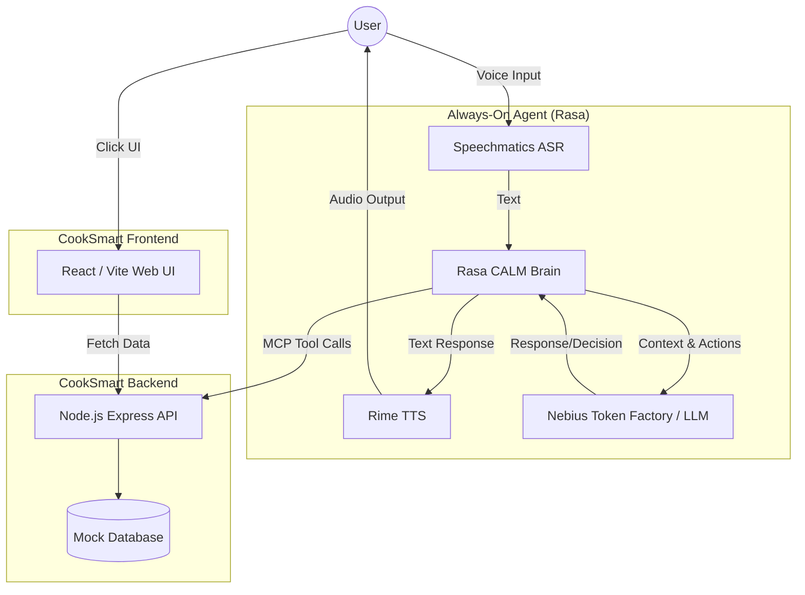

# CookSmart Always-On Agent 系統架構設計

## 系統總覽 (System Overview)
此 MVP 將結合 Hackathon 的 `rasa-bos-hackathon-2026/starter` 架構與 CookSmart 原有的 Frontend / Backend。

## 元件說明 (Component Details)

### 1. Rasa CALM Brain
負責對話流程控制、跨對話記憶 (Persistent Memory) 管理，以及處理使用者的意圖。

### 2. Speechmatics & Rime (耳朵與嘴巴)
處理語音轉文字 (Speech-to-Text) 以及文字轉語音 (Text-to-Speech)，提供完全無手的語音互動介面。

### 3. Node.js Express API (CookSmart Backend)
提供各種商業邏輯的 RESTful API，並且將特定的 Endpoint 暴露為 MCP Tools 給 Rasa Agent 呼叫。在 MVP 階段，這些 API 將實作為 Mock API 來加速驗證概念。
